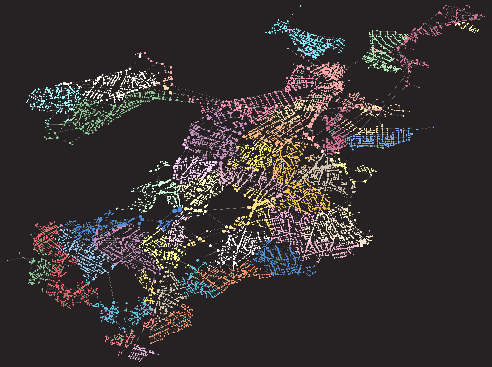
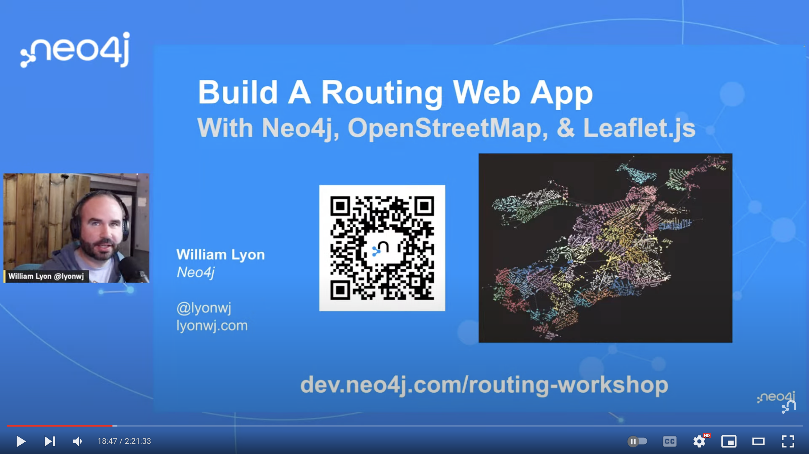
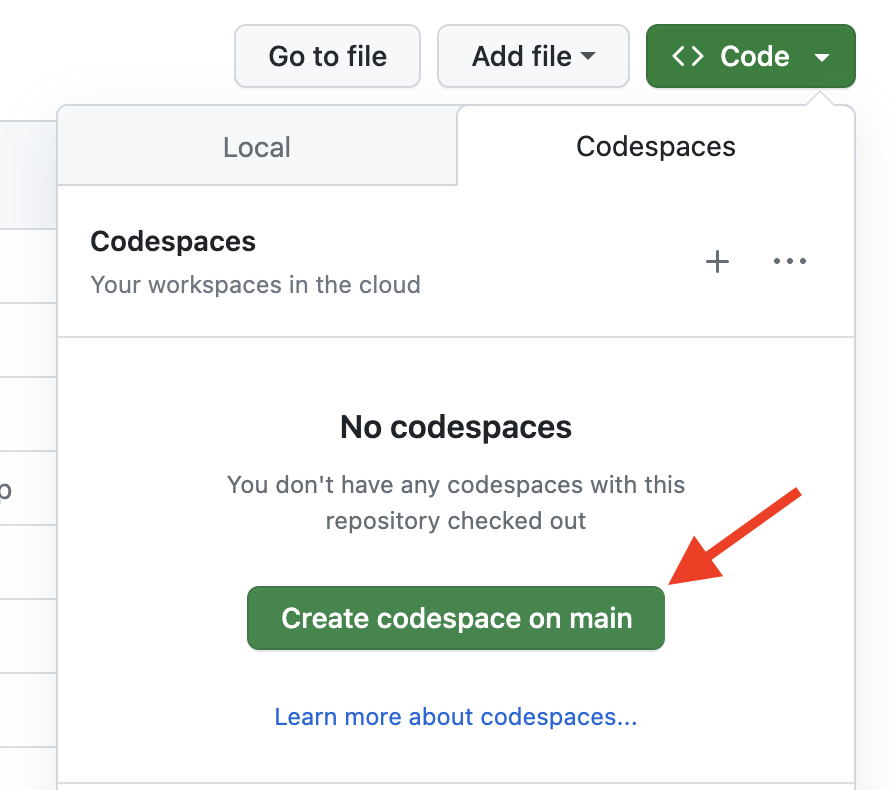
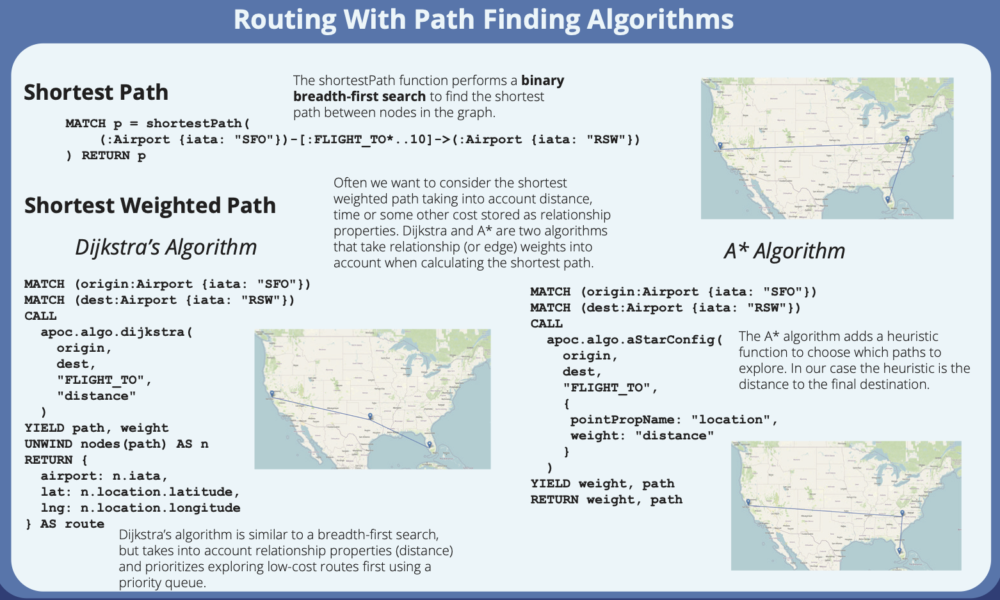

# Build A Routing Web Application With OpenStreetMap, Neo4j, & Leaflet.js



* Slides: [dev.neo4j.com/routing-workshop](https://dev.neo4j.com/routing-workshop)
* Tutorial: [Published On Medium here](https://medium.com/neo4j/build-a-routing-web-app-with-neo4j-openstreetmap-and-leaflet-js-bdc66443132c)
* Video: [Workshop recording](https://www.youtube.com/watch?v=Z4XZgsbaD9c)

[](https://www.youtube.com/watch?v=Z4XZgsbaD9c)

Using GitHub Codespaces is the recommended way to create a Python development environment for this workshop.



## Step 1: OpenStreetMap Data Import With OSMNx


First, create a [Neo4j AuraDB instance](https://dev.neo4j.com/aura).

Then use [this notebook](https://github.com/johnymontana/openstreetmap-routing-web-app-workshop/blob/main/notebooks/01-import.ipynb) to import OpenStreetMap and address data into your Neo4j instance.


## Step 2: Leaflet.js Web Map


[This file](https://github.com/johnymontana/openstreetmap-routing-web-app-workshop/blob/main/web/address_routing.html) contains HTML and JavaScript for a simple address search and routing web app. Edit the file to connect to your Neo4j AuraDB instance.

We're using Dijkstra's algorithm for routing - can you improve the routing query using the A* algorithm?




## Setup

This project uses Poetry to manage dependencies and python virtual environments. After cloning this repository, be sure [Poetry is installed](https://python-poetry.org/) then run:

```
poetry install
```

To add dependecies:

```
poetry add foobar
```

Update `.env` with any relevant environment variables, then to start Jupyter:

```
poetry shell
jupyter notebook
```
